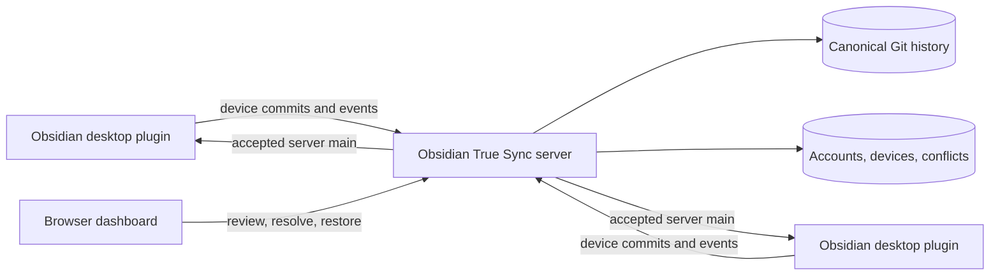

<div align="center">

# Obsidian True Sync

**Git-backed Obsidian sync with durable conflicts, recoverable local applies, and a history you can inspect.**

Self-hosted server · Desktop plugin · Browser dashboard

</div>

> [!IMPORTANT]
> Obsidian True Sync is under active development. The plugin is desktop-only, requires the native `git` executable, and should be tested with copied vaults before it is trusted with primary data.

## Why Obsidian True Sync?

Most sync tools answer one question: "What is the latest copy?" Obsidian True Sync also keeps the history needed to answer how it got there, what changed concurrently, and how to recover safely.

Each vault has a canonical Git history on the server. Devices submit their own commits, the server validates and merges them, and clients apply accepted changes through Obsidian's vault API. Git stays behind the scenes: no visible `.git` directory is created in your vault.

- **Full-vault sync** for notes, attachments, Canvas files, Bases, themes, snippets, and community plugin data, with explicit safety exclusions.
- **Durable conflict handling** instead of last-writer-wins replacement.
- **Browser-based review** for conflicts, device status, note history, and restores.
- **Rename-aware history** with source and rendered Markdown diffs.
- **Safe restoration** that creates a new commit rather than rewriting existing history.
- **Recovery before replacement** through local snapshots, patches, ref packs, checksums, and replayable apply journals.
- **Empty-folder synchronization** using explicit directory intent outside Git.
- **Integrity-first operations** with readiness checks, redacted diagnostics, and non-destructive Git maintenance.
- **Multi-user isolation** where each vault has exactly one owner.

## How It Works



The server owns canonical `main`. Each paired device has a protected device ref and cannot advance `main` directly. Concurrent work is either merged safely or recorded as a conflict for review. Pulls use recovery bundles and apply journals before changing local files.

## Security Model

The server is trusted and can read vault content while syncing, merging, rendering conflicts, and serving history. This is **not** an end-to-end encrypted or zero-knowledge system.

A production deployment should provide:

- HTTPS at the public endpoint;
- a long, randomly generated `OBTS_SESSION_SECRET`;
- restrictive ownership and permissions for persistent state;
- encrypted disks, volumes, snapshots, or backups where required;
- point-in-time-consistent backups of metadata and Git stores;
- protected operator access to local recovery commands.

See [Persistent State and Backup](docs/persistent-state.md) for the complete backup and restore contract.

## Quick Start With Docker

Requirements: Docker and a desktop installation of Obsidian.

```sh
git clone https://github.com/nareto/obts.git
cd obts

docker build -t obts .
docker volume create obts-data

docker run -d --name obts \
  -p 3000:3000 \
  -e OBTS_PUBLIC_BASE_URL=http://127.0.0.1:3000 \
  -e OBTS_SESSION_SECRET=replace-with-a-long-random-value \
  -v obts-data:/var/lib/obts \
  obts
```

Open `http://127.0.0.1:3000`, complete the initial setup, create a vault, and create a pairing token for your first device.

Check readiness at any time:

```sh
docker exec obts node dist/src/cli.js health ready --json
```

For anything beyond local evaluation, place the service behind HTTPS and replace every example credential before starting it.

## Install The Obsidian Plugin

The current plugin artifact is tracked in [`obsidian-plugin/`](obsidian-plugin/).

1. Copy that directory to `<vault>/.obsidian/plugins/obts/`.
2. Enable **Obsidian True Sync** under Obsidian's community plugin settings.
3. Enter the server URL, device name, and one-time pairing token.
4. Pair the device and confirm the initial import when appropriate.
5. Pair a second copied vault and complete the [manual smoke test](docs/phase3-smoke-test.md) before using primary data.

Plugin commands include:

- `Pair device`
- `Sync once`
- `Confirm initial import and sync`
- `Replace local with server state`
- `Rebuild from server main`

Local runtime state and hidden client history live under `.obts/`, which is never synchronized as vault content.

## Develop From Source

Requirements:

- Node.js 24 or newer
- native `git`
- npm

```sh
npm ci
npm test
npm run build

export OBTS_DATA_DIR="$PWD/.obts-server"
export OBTS_PUBLIC_BASE_URL=http://127.0.0.1:3000
export OBTS_SESSION_SECRET=replace-with-a-long-random-value
node dist/src/cli.js serve
```

Useful commands:

```sh
npm run check       # TypeScript and dashboard build checks
npm test            # Full Vitest suite
npm run build       # Dashboard and server build
just arch           # Render and serve the Structurizr architecture model
```

Run `node dist/src/cli.js help` for setup, vault, pairing, device, conflict, health, integrity, and local admin-recovery commands. Password-bearing automation should use `--password-env` rather than command-line values.

## What Gets Synchronized?

Obsidian True Sync synchronizes the full vault after hard safety exclusions.

Included examples:

- Markdown, Canvas, and Bases files;
- attachments and `.trash/` content;
- themes, snippets, and most `.obsidian/` configuration;
- community plugin files other than this plugin's own installation directory.

Always excluded:

- `.obts/**`;
- visible `.git/**` repositories;
- Obsidian cache and workspace files;
- `.obsidian/plugins/obts/**`.

Community plugin history is metadata-only by default in the dashboard; revealing a selected historical body requires an explicit, recently authenticated action.

## Operations And Documentation

- [Phase 1 operations](docs/phase1-operations.md) — configuration, CLI, container, and recovery basics
- [Phase 2 operations](docs/phase2-operations.md) — dashboard conflict resolution
- [Phase 3 operations](docs/phase3-operations.md) — history, restore, diagnostics, integrity, and maintenance
- [Persistent state and backup](docs/persistent-state.md) — authoritative state and consistency requirements
- [OpenAPI contract](openapi/openapi.yaml) — HTTP API definition
- [Architecture overview](architecture/docs/01-overview.md) — system boundaries and Git model
- [Product requirements](prd.md) — detailed behavior and design constraints

## Current Boundaries

Obsidian True Sync deliberately does not provide mobile support, shared vault membership, real-time collaborative editing, zero-knowledge storage, or destructive history compaction. These boundaries keep recovery behavior explicit and Git history authoritative while the core sync model matures.
