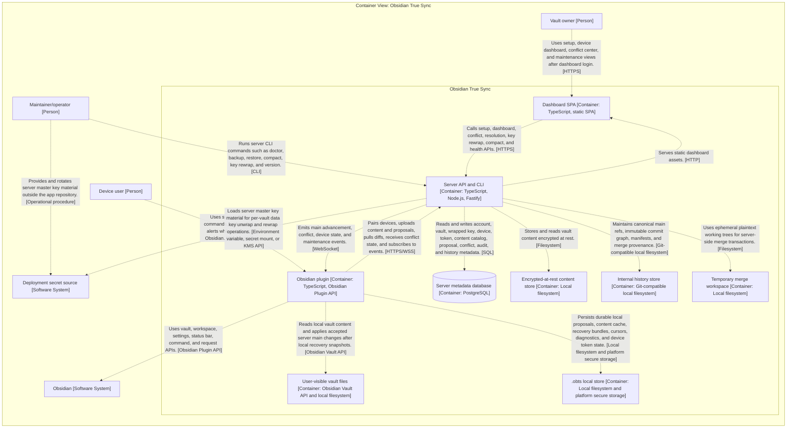
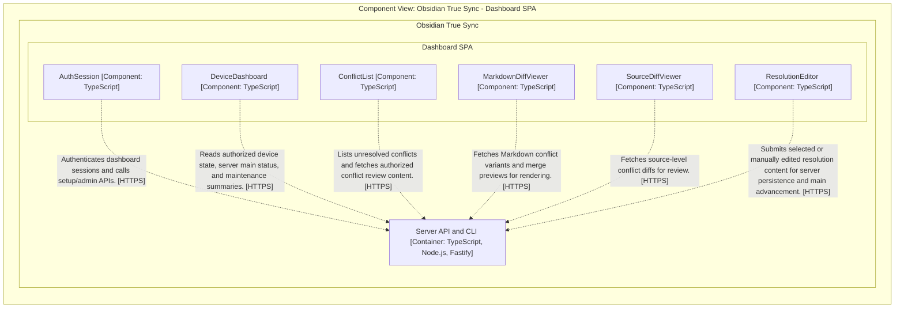
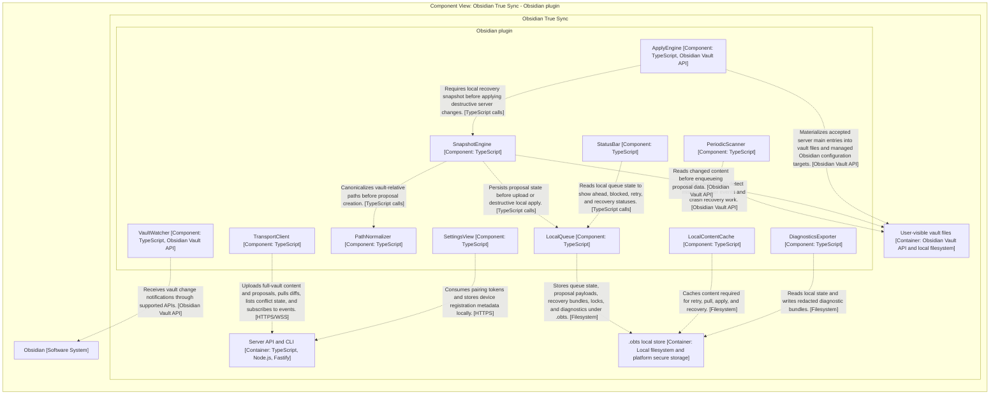
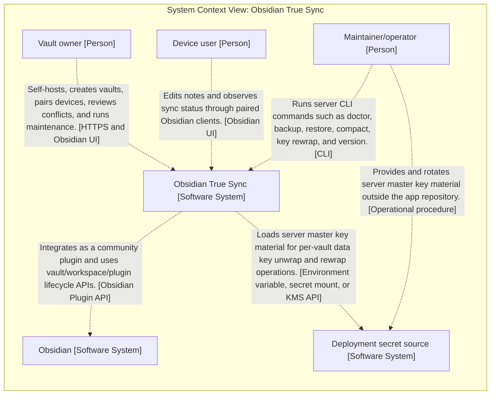

# Architecture Diagrams

_Generated from `workspace.dsl`; do not edit by hand._

## structurizr Containers

## structurizr DashboardComponents

## structurizr PluginComponents

## structurizr ServerComponents

```mermaid
graph LR

  subgraph diagram ["Component View: Obsidian True Sync - Server API and CLI"]

    5["Deployment secret source [Software System]"]

    subgraph 6 ["Obsidian True Sync"]

      subgraph 7 ["Server API and CLI"]

        10["DeviceService [Component: TypeScript]"]
        11["AtRestKeyManager [Component: TypeScript, Node crypto]"]
        12["ContentStoreService [Component: TypeScript]"]
        13["ProposalService [Component: TypeScript]"]
        14["HistoryService [Component: TypeScript]"]
        15["MergeCoordinator [Component: TypeScript]"]
        16["SemanticMergeService [Component: TypeScript]"]
        17["ConflictService [Component: TypeScript]"]
        18["NotificationHub [Component: TypeScript]"]
        19["BackupService [Component: TypeScript]"]
        20["AuditLogService [Component: TypeScript]"]
        21["HealthService [Component: TypeScript]"]
        8["AuthService [Component: TypeScript]"]
        9["VaultService [Component: TypeScript]"]
      end

      29["Obsidian plugin [Container: TypeScript, Obsidian Plugin API]"]
      43[("Server metadata database [Container: PostgreSQL]")]
      44["Encrypted-at-rest content store [Container: Local filesystem]"]
      45["Internal history store [Container: Git-compatible local filesystem]"]
      46["Temporary merge workspace [Container: Local filesystem]"]
    end

    8-. "Reads users and token hashes; writes auth audit metadata. [SQL]" .->43
    9-. "Manages vault records, setup state, owner isolation, and wrapped key metadata. [SQL]" .->43
    9-. "Requests per-vault data key creation for new vaults. [TypeScript calls]" .->11
    10-. "Registers, updates, and revokes devices. [SQL]" .->43
    11-. "Reads runtime master key material without printing or persisting it. [Environment variable, secret mount, or KMS API]" .->5
    11-. "Stores and reads wrapped per-vault data keys and key version metadata. [SQL]" .->43
    12-. "Requests per-vault data keys for encryption/decryption at persistence boundaries. [TypeScript calls]" .->11
    12-. "Writes encrypted-at-rest content bytes and reads them for authorized workflows. [Filesystem]" .->44
    12-. "Records content catalog metadata, hashes, sizes, and storage refs. [SQL]" .->43
    13-. "Persists uploaded content before accepting proposals. [TypeScript calls]" .->12
    13-. "Submits proposal manifests for server-side merge or conflict routing. [TypeScript calls]" .->15
    14-. "Reads and writes commit graph, manifests, refs, and merge provenance. [Filesystem]" .->45
    14-. "Records main refs, commit indexes, and transaction state. [SQL]" .->43
    15-. "Reads base/current/proposed manifests and advances main after clean merge or resolution. [TypeScript calls]" .->14
    15-. "Decrypts candidate content for merge and persists merged results encrypted at rest. [TypeScript calls]" .->12
    15-. "Checks out transaction-scoped plaintext working trees for content-aware merge. [Filesystem]" .->46
    15-. "Requests conservative text and Markdown merge for same-path changes. [TypeScript calls]" .->16
    16-. "Reads and writes plaintext merge candidates inside the transaction workspace. [Filesystem]" .->46
    15-. "Creates conflict records when server-side merge is ambiguous or unsafe. [TypeScript calls]" .->17
    17-. "Stores conflict state, affected paths, base/current/proposed refs, and resolution refs. [SQL]" .->43
    17-. "Reads conflict variants and persists resolution content encrypted at rest. [TypeScript calls]" .->12
    18-. "Emits main advancement, conflict, device state, and maintenance events. [WebSocket]" .->29
    19-. "Reads or snapshots server metadata and wrapped key metadata for backup and restore. [SQL]" .->43
    19-. "Copies encrypted-at-rest content during backup and restore. [Filesystem]" .->44
    19-. "Copies internal history state during backup and restore. [Filesystem]" .->45
    20-. "Writes redacted audit events without raw tokens, passwords, key material, or full note bodies. [SQL]" .->43
    21-. "Checks database readiness. [SQL]" .->43
    21-. "Checks encrypted content store writability. [Filesystem]" .->44
    21-. "Checks internal history store accessibility. [Filesystem]" .->45
    21-. "Checks key-manager readiness and master key availability. [TypeScript calls]" .->11

  end

```

## structurizr SystemContext

